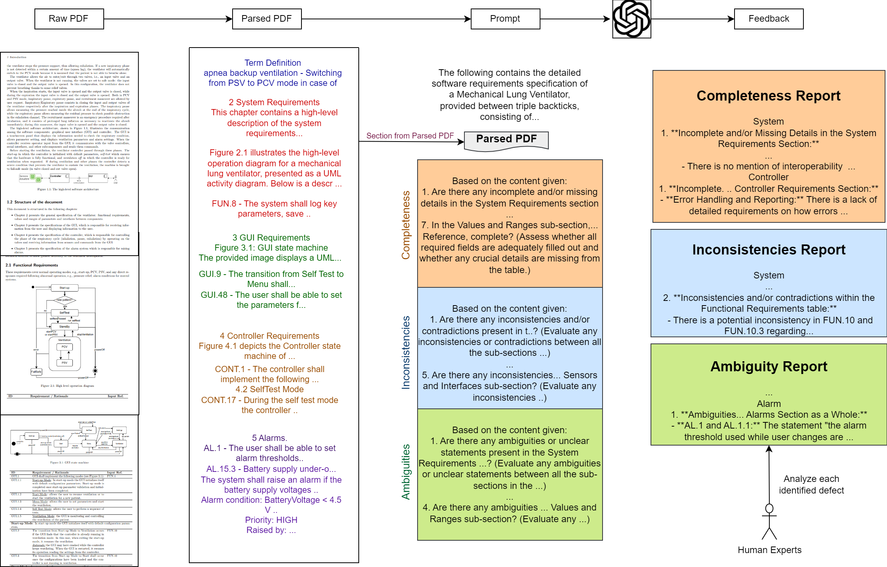
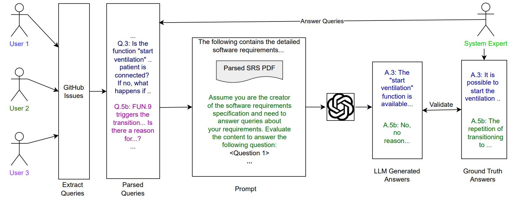

# Can GPT-4 aid in detecting ambiguities, inconsistencies, and incompleteness in requirements analysis? A comprehensive case study.
Source-code, raw-outputs, and input of our academic paper.

***Summary of Study** Effective software projects hinge on robust requirements, yet flawed requirements often lead to costly delays and revisions. While tools have been developed to identify defects in Software Requirements Specifications (SRS), the advent of Large Language Models (LLMs) like GPT-4 presents new opportunities for enhancing requirements quality. However, the potential of LLMs in this realm remains largely unexplored, particularly in the context of large-scale industrial documents. To bridge this gap, we investigate the efficacy of zero-shot GPT-4 in various requirements analysis tasks using an industrial software specification document. Our study evaluates LLM performance in detecting defects, such as ambiguities, inconsistencies, and incompleteness, while also analyzing GPT-4's ability to identify issues across version iterations and support technical experts in requirements analysis. Qualitatively, we identify key limitations of LLMs in defect detection, notably their inability to cross-reference throughout the document and their constrained understanding of specialized contexts. Quantitatively, we find that while LLMs excel in identifying incomplete requirements (precision 0.61), their performance is less impressive in detecting inconsistencies (precision 0.43) and ambiguities (precision 0.39). Although GPT-4 demonstrates promise in automating early defect detection across versions and providing accurate technical answers, our results underscore that they cannot entirely replace human analysts due to their lack of nuanced domain knowledge in a zero-shot setting. Nevertheless, avenues like few-shot learning and complex prompt design offer the potential to enhance LLM precision in defect detection.*


##  Pipeline


Pipeline for generating LLM feedback on requirement analysis using the GPT-4 model. Given a PDF, we parse and extract the document's contents into different sections, including figure descriptions. We then prompt the GPT model to provide structured comments for each defect category. The prompt is fed with context that includes a complete section (e.g., System, Controller, etc.) from the parsed PDF to ensure the input is within the token constraints of the GPT model. The GPT models generate feedback in a single pass, structured across the three defect categories (ambiguities, inconsistencies, incompleteness) and the various SRS sections. Human experts analyze the feedback according to the predefined evaluation criteria.


## Requirements

- python == 3.9.13
- OpenAI Access key and openai


## Pipeline for QA Analysis



Pipeline for Analyzing GPT-4 Capabilities in Answering Questions to Aid Stakeholders in Ensuring the Quality of Requirements: Questions related to system modeling are extracted from GitHub issues and parsed to be fed to the GPT-4 model via the OpenAI API. System experts produce the Ground Truth (GT) answers to these questions. Each LLM-generated answer is then validated against the GT answers.

Link to GitHub Issues for extraction: https://github.com/foselab/abz2024_casestudy_MLV/issues

## Reference
If you find our work useful in your research or if you use parts of this code please consider citing our [paper]():


```
@article{,
  title={Can GPT-4 aid in detecting ambiguities, inconsistencies, and incompleteness in requirements analysis? A comprehensive case study.},
  author={},
  journal={},
  volume={},
  number={},
  pages={},
  year={2024},
  publisher={IEEE}
}
```
